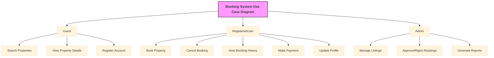

# Requirement Analysis in Software Development

## Introduction

Requirement Analysis is a **critical phase in the Software Development Lifecycle (SDLC)** where the project team gathers, analyzes, and defines the requirements of a software product.  
This ensures that all stakeholders have a **clear and mutual understanding** of what the system should do and how it should perform.

The purpose of this repository is to **document the processes, methodologies, and best practices** for performing requirement analysis in software development projects.  
It will serve as a **reference guide** for developers, designers, project managers, and other stakeholders involved in defining system requirements.

---

## What is Requirement Analysis?

Requirement Analysis is the process of **collecting, evaluating, and specifying the needs and expectations of stakeholders** for a software system.  
It ensures that the project team **understands exactly what the system should achieve** and provides a foundation for design, development, and testing.

### Importance in the Software Development Lifecycle (SDLC)

1. **Clarity and Understanding**  
   Reduces ambiguity by ensuring all stakeholders have a shared understanding of the system’s objectives.

2. **Scope Definition**  
   Clearly outlines the project scope to prevent scope creep and manage expectations.

3. **Basis for Design and Development**  
   Provides a structured foundation for system design, architecture, and implementation.

4. **Cost and Time Estimation**  
   Helps estimate resources, time, and budget required for the project accurately.

5. **Quality Assurance**  
   Ensures that the final product meets the documented requirements, leading to higher customer satisfaction.

Requirement Analysis is thus a **cornerstone of successful software development**, ensuring projects are delivered on time, within budget, and aligned with stakeholder needs.

---

## Why is Requirement Analysis Important?

Requirement Analysis is **critical in the SDLC** for several reasons:

1. **Ensures Stakeholder Alignment**  
   By gathering and analyzing requirements, the team ensures that **everyone agrees on what the system should do**, reducing misunderstandings and conflicts later.

2. **Prevents Scope Creep**  
   Clearly documented requirements help **define the project boundaries**, preventing uncontrolled changes that could impact timelines and budgets.

3. **Supports Accurate Planning and Estimation**  
   Understanding requirements in detail allows project managers to **estimate time, resources, and costs more precisely**, resulting in better project planning.

4. **Improves Product Quality**  
   Requirement Analysis ensures the system **meets both functional and non-functional needs**, leading to a product that satisfies users and stakeholders.

5. **Facilitates Communication**  
   Serves as a communication tool among **developers, designers, testers, and clients**, ensuring everyone has a shared understanding of expectations.

---

## Key Activities in Requirement Analysis

Requirement Analysis involves several **structured activities** to ensure the system meets stakeholder expectations and provides a seamless user experience. The key activities include:

- **Requirement Gathering 🗂️**  
  Collect initial requirements from stakeholders using techniques such as:  
  - **Interviews:** Engage directly with stakeholders to understand their goals and expectations.  
  - **Surveys/Questionnaires:** Gather input from a broader audience efficiently.  
  - **Workshops:** Collaboratively discuss requirements and priorities.  
  - **Observation:** Watch end-users interact with current systems to identify pain points.  
  - **Document Analysis:** Review existing documentation, reports, and workflows for relevant information.

- **Requirement Elicitation ✍️**  
  Refine and explore requirements to ensure completeness and clarity:  
  - **Brainstorming:** Generate ideas and uncover potential needs.  
  - **Focus Groups:** Engage small stakeholder groups for detailed discussions.  
  - **Prototyping:** Create wireframes or mockups to help stakeholders visualize the system and refine requirements.  

- **Requirement Documentation 📚**  
  Organize and record requirements in a structured format for reference and development:  
  - **Requirement Specification Documents:** Detailed listing of functional and non-functional requirements.  
  - **User Stories:** Describe features from the user perspective.  
  - **Use Cases:** Visualize user-system interactions to ensure clarity of functionality.

- **Requirement Analysis and Modeling 📊**  
  Examine, prioritize, and structure requirements to assess feasibility and impact:  
  - **Requirement Prioritization:** Focus on high-impact and critical features first.  
  - **Feasibility Analysis:** Assess technical, financial, and time constraints.  
  - **Modeling:** Use tools like data flow diagrams, entity-relationship diagrams, or wireframes to visualize requirements and interactions.  

- **Requirement Validation ✅**  
  Confirm that documented requirements are accurate, complete, and testable:  
  - **Review and Approval:** Collaborate with stakeholders to ensure accuracy.  
  - **Acceptance Criteria:** Define clear and measurable criteria for each requirement.  
  - **Traceability:** Track each requirement throughout design, development, and testing to ensure nothing is missed.

By performing these activities meticulously, teams can **deliver a user-centered, intuitive, and functional product**, while reducing misunderstandings and costly revisions later in the development lifecycle.

---

## Types of Requirements

Requirement Analysis involves understanding both **what the system should do** and **how it should perform**. These are captured as **Functional** and **Non-functional Requirements**.

### Functional Requirements ⚙️

Functional requirements describe **the specific behaviors or functions of the system**—what the system must do to meet user needs.

**Examples for a Booking Management Project:**

- **Search Properties:** Users can search for properties by location, price, availability, and other criteria.  
- **User Registration:** New users can create accounts with personal details and login credentials.  
- **Property Listings:** Display properties with essential details such as photos, description, price, and amenities.  
- **Booking System:** Users can select dates, confirm bookings, view booking history, and cancel or modify bookings.  
- **User Authentication:** Secure login and registration processes, including password management and email verification.  
- **Payment Processing:** Users can make secure payments for bookings through integrated payment gateways.

### Non-Functional Requirements 🛡️

Non-functional requirements describe **how the system should perform** rather than what it does. They focus on system attributes like performance, usability, and reliability.

**Examples for a Booking Management Project:**

- **Performance:** Pages load within 2 seconds; system handles up to 1,000 concurrent users.  
- **Security:** Data encryption for sensitive information, secure login, and protection against common vulnerabilities.  
- **Scalability:** Ability to scale horizontally to support increasing traffic and user base.  
- **Usability:** Intuitive user interface with clear navigation and responsive design for desktop and mobile devices.  
- **Reliability:** System uptime of 99.9% with quick recovery from failures.  
- **Maintainability:** Code is modular and well-documented for easier updates and bug fixes.  

By defining both **functional and non-functional requirements**, development teams ensure that the system not only **performs its intended tasks** but also **meets user expectations for quality, security, and usability**.

---

## Use Case Diagrams

Use Case Diagrams are **visual representations of the interactions between users (actors) and the system**, helping teams understand system functionality and requirements.  
They provide the following benefits:

- Clarify how different users interact with the system.
- Help identify required functionalities and edge cases.
- Improve communication among stakeholders, designers, and developers.

### Booking System Use Case Diagram

